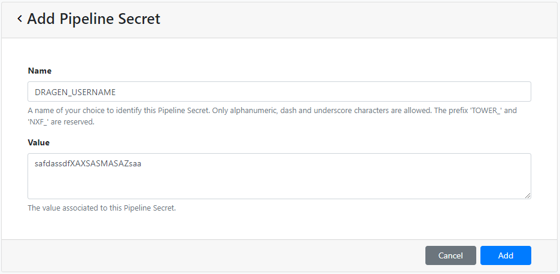
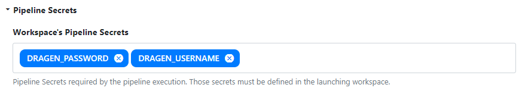

[](https://www.nextflow.io/)

> THIS IS A PROOF-OF-CONCEPT REPOSITORY THAT IS UNDER ACTIVE DEVELOPMENT. SYNTAX, ORGANISATION AND LAYOUT MAY CHANGE WITHOUT NOTICE!

## Introduction

**nf-dragen** is a simple, proof-of-concept pipeline to run the [Illumina DRAGEN](https://emea.illumina.com/products/by-type/informatics-products/dragen-bio-it-platform.html) licensed suite of tools.

The pipeline is built using [Nextflow](https://www.nextflow.io), a workflow tool to run tasks across multiple compute infrastructures in a very portable manner. It uses Docker containers making installation trivial and results highly reproducible. This pipeline has only been tested on AWS Batch.

## Integration with Seqera Platform

We have streamlined the process of deploying Nextflow workflows that utilise Illumina DRAGEN on AWS Batch via Seqera.

### Prerequisites

#### Credentials

You will need to obtain the following information from the Illumina DRAGEN team:

1. Private AMI id in an AWS region with DRAGEN F1 instance availability
2. Username to run DRAGEN on the CLI via Nextflow
3. Password to run DRAGEN on the CLI via Nextflow

#### Pipeline implementation

Please see the [dragen.nf](modules/local/dragen.nf) module implemented in this pipeline for reference.

Any Nextflow processes calling the `dragen` command must have:

1. `label dragen` ([see docs](https://www.nextflow.io/docs/latest/process.html?highlight=label#label)). This is how Seqera will determine which processes need to be specifically executed on DRAGEN F1 instances.

   ```nextflow
   process DRAGEN {
       label 'dragen'

       <truncated>
   }
   ```

2. `secret DRAGEN_USERNAME` and `secret DRAGEN_PASSWORD` ([see docs](https://www.nextflow.io/docs/latest/secrets.html?highlight=secrets#secrets)). These Secrets will be provided securely to the `--lic-server` option when running DRAGEN on the CLI to validate the license.

   ```nextflow
   process DRAGEN {
       secret 'DRAGEN_USERNAME'
       secret 'DRAGEN_PASSWORD'

       <truncated>

       script:
       """
       /opt/edico/bin/dragen \\
               --lic-server=\$DRAGEN_USERNAME:\$DRAGEN_PASSWORD@license.edicogenome.com \\
               <other_options>
       """
   }
   ```

### Compute Environment

You can use Seqera Batch Forge to automatically create a separate AWS Batch queue with dedicated F1 instances to run DRAGEN.

In the Seqera UI, go to `Compute Environments` -> `Add Compute Environment` and fill in the appropriate settings for your AWS Batch environment. Additionally, you will be able to paste your private DRAGEN AMI id as shown in the image below:


Click on `Add` to create the Compute Environment.

> Please ensure that the `Region` you select contains DRAGEN F1 instances.

### Secrets

As outlined in [this blog](https://seqera.io/blog/pipeline-secrets-secure-handling-of-sensitive-information-in-tower/) you can add Secrets to Seqera to safely encrypt the username and password information required to run DRAGEN via Nextflow.

In the Seqera UI, go to `Secrets` -> `Add Pipeline Secret` and add both of the Secrets as shown in the images below:

1. `DRAGEN_USERNAME`



2. `DRAGEN_PASSWORD`


### Pipeline

In the Seqera UI, go to `Launchpad` -> `Add Pipeline`. Fill in the appropriate details to add your pipeline and ensure that the Compute Environment and Secrets you created previously are both defined for use by the pipeline:



Click on `Add` to create the pipeline and launch it when you are ready!

## Credits

nf-dragen was originally written by [Harshil Patel](https://github.com/drpatelh) and [Graham Wright](https://github.com/gwright99) and [Paolo Di Tommasso](https://github.com/pditommaso), [Seqera Labs](https://seqera.io/).

## Citations

The nf-core pipeline template was used to create the skeleton of this pipeline but there are no plans to contribute it to nf-core at this point.

You can cite the `nf-core` publication as follows:

> **The nf-core framework for community-curated bioinformatics pipelines.**
>
> Philip Ewels, Alexander Peltzer, Sven Fillinger, Harshil Patel, Johannes Alneberg, Andreas Wilm, Maxime Ulysse Garcia, Paolo Di Tommaso & Sven Nahnsen.
>
> _Nat Biotechnol._ 2020 Feb 13. doi: [10.1038/s41587-020-0439-x](https://dx.doi.org/10.1038/s41587-020-0439-x).
